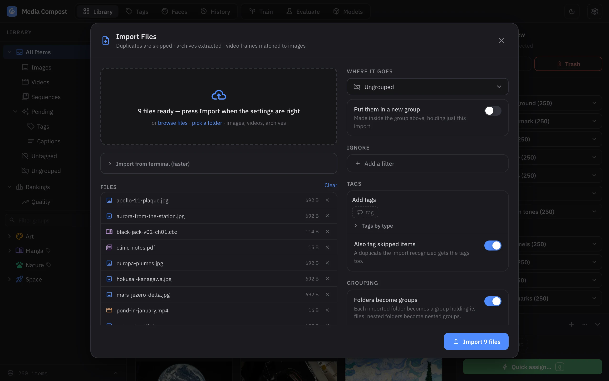
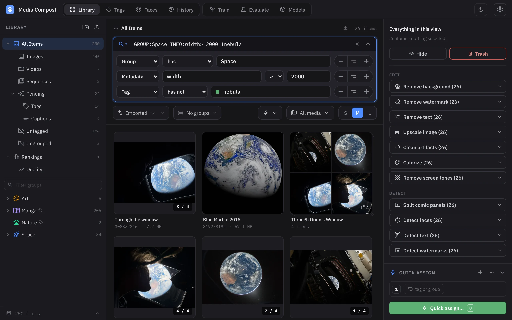
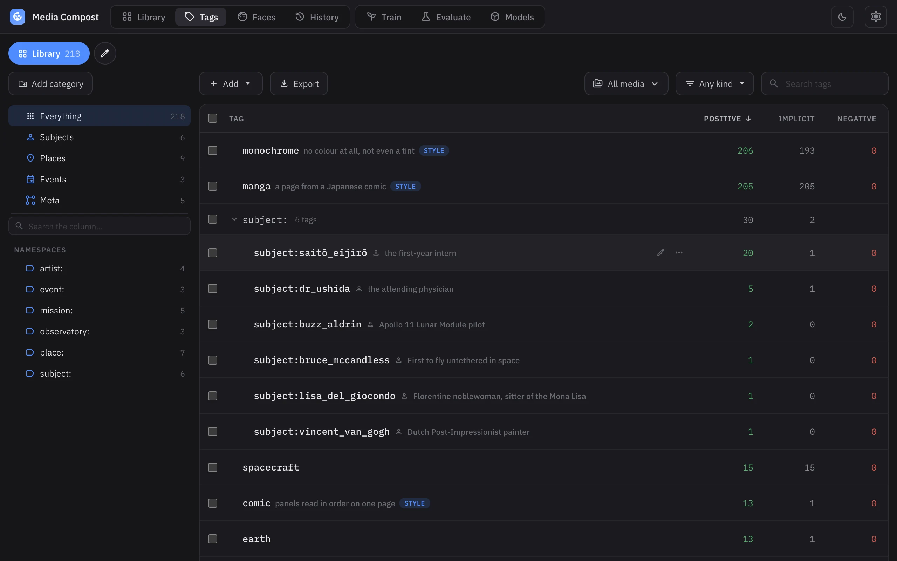
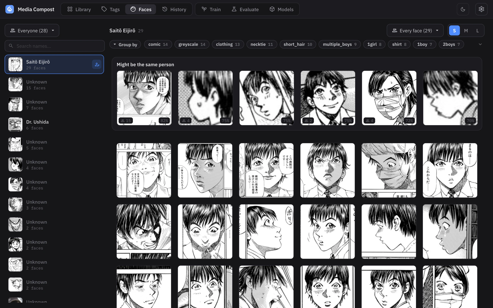
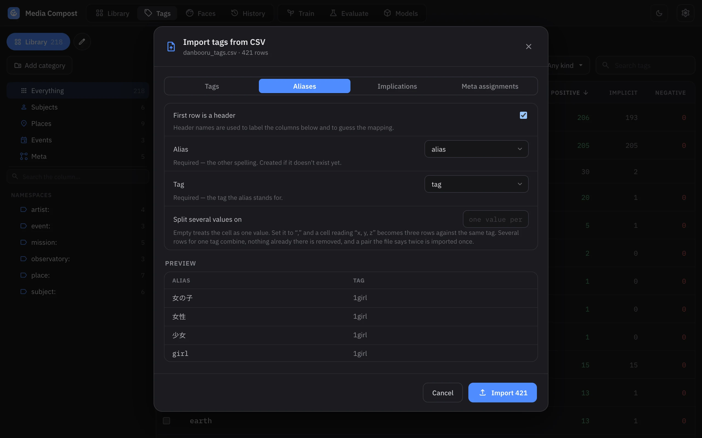
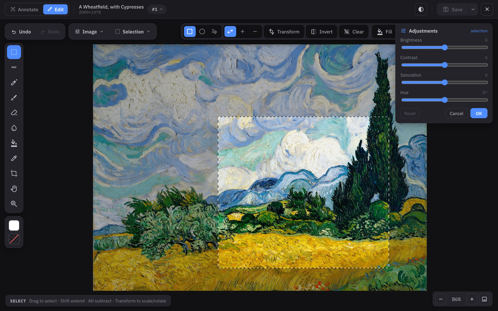
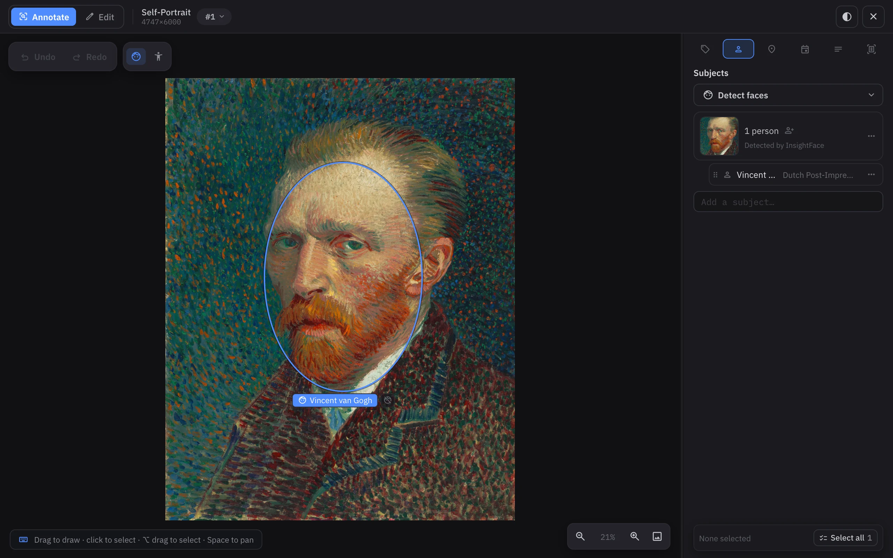
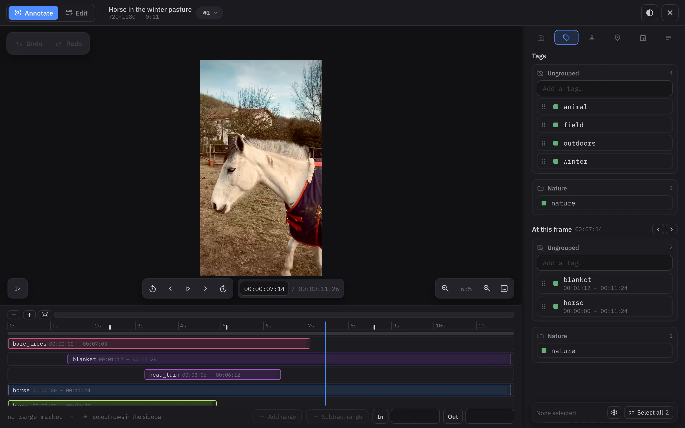
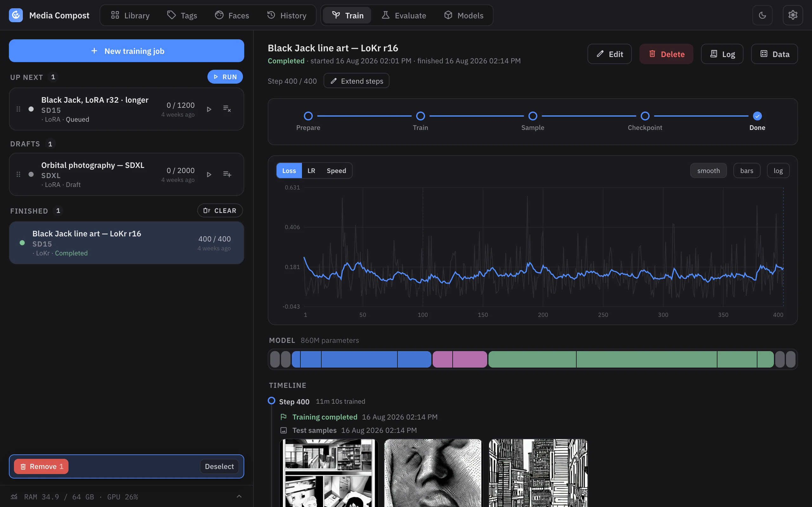

# What Media Compost does

A tour of the app, one screen at a time. Every section links to the page that
covers it properly.

## Import once, keep one copy

{ .mc-shot }

Drop in folders, archives (`.zip`, `.cbz`, `.7z`, …), PDFs or videos. Every
file is checked against the library twice: by content hash, so an exact copy
is adopted onto the item you already have rather than stored again, and by a
256-bit perceptual hash, so a rescale, a recompression or a rotation is
offered as an **alternative file** on that item instead of becoming a second
one. A folder becomes a group (an archive can too); a comic — or a PDF, its
pages rendered losslessly, or an animated GIF, frame by frame — becomes an
ordered **sequence**; a video gets every frame hashed, so a screenshot
imported months later finds the film it came from.

Photos bring their own metadata with them: EXIF, GPS and the IPTC location
line are indexed and searchable, a photo that names its city is offered that
[place](places.md) — never assigned behind your back — and an image that is
stored rotated is detected and folded onto its upright twin.

[:octicons-arrow-right-24: Importing files](import.md)

## Find it again

{ .mc-shot }

The search box and the visual query builder are two views of one condition
tree, bound both ways — edit either and the other follows immediately. A query
matches on tags, groups (including everything under them), captions,
instructions, links, people, places, events, capture dates and any indexed
metadata field:

```text
portrait !blurry INFO:width>=1024 GROUP:Scans SUBJECT:alice#12
```

Numeric comparisons are precision-aware — `INFO:aspect=0.70` means what you
typed it to, not what the float rounds to — and tags that carry a number
(`height:172cm`, `quality:7`) compare as numbers with `VALUE:`. Likeness is
searchable too: `COLORLIKE:` finds pictures with a similar palette, and the
grid can sort by colour. Searches you keep are saved per user, and the whole
scope lives in the URL, so a view is a link.

[:octicons-arrow-right-24: Searching](search.md)

## A tag set, not a pile of labels

{ .mc-shot }

Tags **imply** other tags — `poodle` entails `dog` and `pet`, transitively —
so searching for the general finds the specific without anybody tagging both.
They carry **aliases**, they **merge** without losing assignments, boxes or
implications, and every change is logged and revertible.

Four lists share that one tag set, because each answers a different
question about the same tags:

- **[Tags](tags.md)** — what a picture is like.
- **[Subjects](subjects-and-faces.md)** — who is in it, with ages per
  appearance, detected faces, clusters and name suggestions.
- **[Places](places.md)** — where it was taken, as one address line, with a
  place inside another implying the one above it.
- **[Events](events.md)** — what was happening, as a time span with venues,
  which can then say *when* an undated picture was taken.

{ .mc-shot }

Two face detectors — one for photographs, one for illustration — find the
faces, cluster them and suggest names; naming a cluster assigns that person's
tag to every picture it appears in. Answering them is a tab of its own: the
clusters down one side, the picked one's crops beside it, and a row of the
crops that look most like it. A tag set that came from somewhere else
arrives as a CSV: names, comments, the counts a booru reported kept apart on
the meta tag that names the site, aliases, implications and meta tags, each
its own file shape, mapped column by column with the first rows previewed
before anything is written. And a **ranking** turns quick side-by-side
comparisons into an order: the judgements are the record, the standings are
fitted from them on every read, and **Assign ratings** is what spends them —
it carries the numbers to the pictures nobody compared and writes whatever
tags your own rules ask for.

{ .mc-shot }

## Edit the pixels, and edit the meaning

<div class="grid" markdown>

<div markdown>


### Image editor

Selections (rectangle, ellipse, lasso, wand) with marching ants and pixel-sharp
edges at any zoom, pressure-sensitive brushes, transforms, crop and straighten,
brightness/contrast/saturation/hue with a live full-resolution preview, and
**inpainting** that paints a region away. Saving adds a new source file and
keeps the original.

[:octicons-arrow-right-24: Image editor](image-editor.md)
</div>

<div markdown>


### Annotation editor

Draw a box — or a polygon — by dragging, select one by clicking — no mode to
set first. Faces are ellipses over the picture, named inline, and the sidebar
carries the same tag, subject, place, event, caption and text lists the
library has. On a
**video**, tags carry time ranges instead of geometry, and stills — captured
one at a time or every N seconds — become ordinary items that inherit the
moment's tags.

[:octicons-arrow-right-24: Annotation editor](annotation-editor.md)
</div>

</div>

{ .mc-shot }

On a film every tag is a stretch of time rather than a rectangle, drawn as its
own track under the picture; the sidebar lists what holds at the frame you are
on, and a still captured from the moment inherits exactly those tags.

A film's Edit half is a **video editor** of its own: a cutlist on a track of
blocks — trim, split, move and remove pieces, rotate, crop, resize, change the
frame rate — that touches no file until Save renders it as a new source file,
copying the compressed stream untouched when the cuts allow it.

[:octicons-arrow-right-24: Video editor](video-editor.md)

## Models that run on your machine

Every AI action is a plugin with its own downloaded weights, running **out of
process** (the editor's interactive inpainting is the one that stays in, kept
warm), so a model that crashes takes nothing with it — and none of them is
gated behind a Hugging Face login:

| Task | What it does |
| --- | --- |
| Tagging, captioning | Suggests tags and captions, marked *pending* until you agree |
| Faces | Two detectors — one for photographs, one for illustration — plus clustering and name suggestions |
| Text (OCR) | Reads a page into editable text regions — two engines, one comic-aware |
| Background / watermark / text removal | Erases a region and fills it in |
| Upscale, restore, descreen, colorize | Including manga-specific colorizers and screentone removal |
| Depth, pose, canny, lineart | ControlNet-style control images, stored beside the file |
| Panels | Cuts a comic page into its panels, each a new linked item |
| Classification | Indexes pictures by likeness, so a tagging session shows the likely matches first |

Nothing is applied behind your back: a machine's guess wears an amber border
until somebody accepts it — a suggested caption stays out of search and
training until then, a suggested tag waits in its own Pending group and scope
where it can be reviewed as a batch.

[:octicons-arrow-right-24: Settings and models](settings.md)

## Train on your own library

{ .mc-shot }

Point a training run — LoRA, LoKr, or a full finetune where the model allows it — at a search of your library and queue it. Runs are files on
disk, not database rows, so they survive restarts; the tab shows the loss
curve, the sample images as each one finishes rendering, the phase the trainer
is in and what it is about to do next. Pause and resume mid-run, keep any
checkpoint, and generate test images from it in the Evaluate tab.

Bounding boxes make random crops smarter — a crop keeps the boxes of the tags
it is captioned with — and a subject with no box of their own falls back to
their detected face. A caption can be an **instruction** — how the picture was
made from other items — and an editing model trains on those, reference
pictures and all.

[:octicons-arrow-right-24: Training](training.md) ·
[:octicons-arrow-right-24: Evaluate](evaluate.md)

## A library that merges

Every item owns a plain folder of its source files and artifacts, and the
database beside them is the one record. Two libraries fold together with
`media-compost merge-library`: the other library's own database is read
directly — its whole tag set travels, tags with their implications and
aliases, the group tree, people, places, events, rankings — and its file
bytes are copied across, deduplicating on the way. A backup is a copy of a
directory.

[:octicons-arrow-right-24: Getting started](getting-started.md) ·
[:octicons-arrow-right-24: Command line](cli.md) ·
[:octicons-arrow-right-24: Python API](python-api.md)
